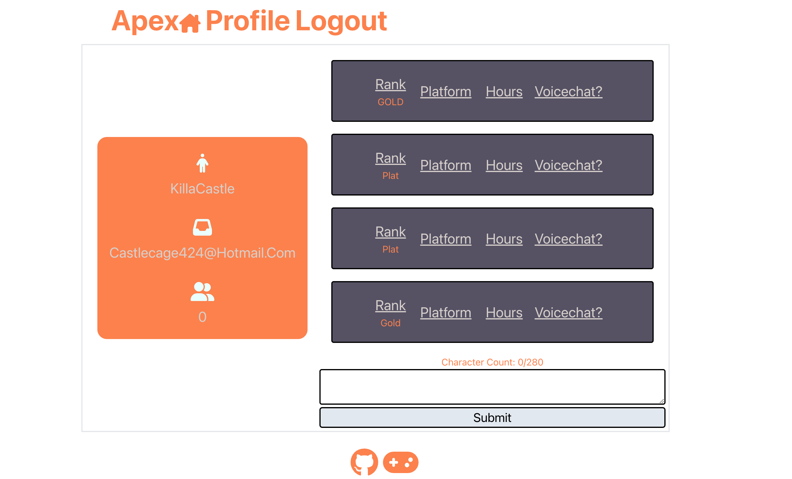

# Apex Ranked Filter 

  ## Description
  We created this application in hopes of giving users a place where they can match with other apex players at their level. Whether it's for casual play or ranked, you're bound to find a good teammate. This was made possible through the use of a filter and querying data from apollo. One of the best parts about this application is how easy it is to use, simply just click on the filter you desire and all the players with that matching filter will be displayed on the home page. One of the challenges we faced was getting all of our queries to work, and we still struggled even after testing them in the graphql. 

  

  ## Table of Contents:
  - [Installation](#installation)
  - [Usage](#usage)
  - [License](#license)
  - [Questions](#questions)

  ## Installation
  Link to deployed site: https://gamer-6.herokuapp.com/

  ## Usage
  

  ## License
  No license used: https://choosealicense.com/no-permission/

  ## Questions
  - Please feel free to email me: kilimba7@yahoo.com